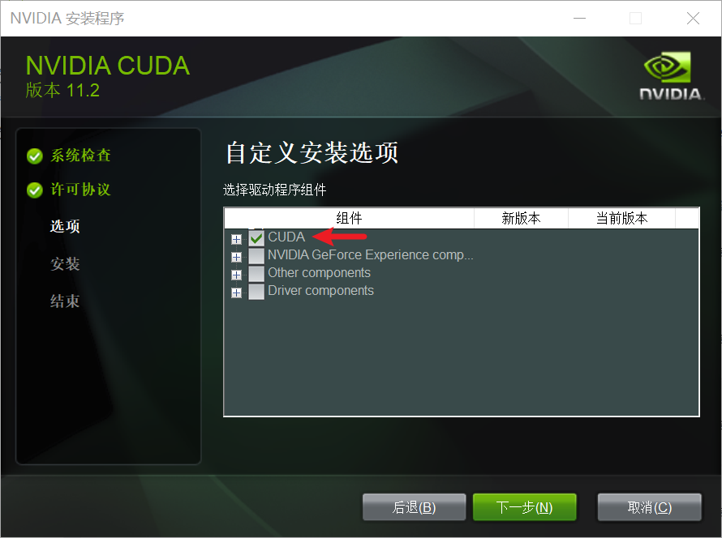
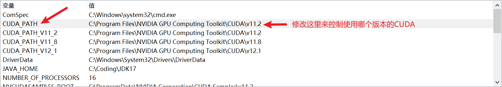
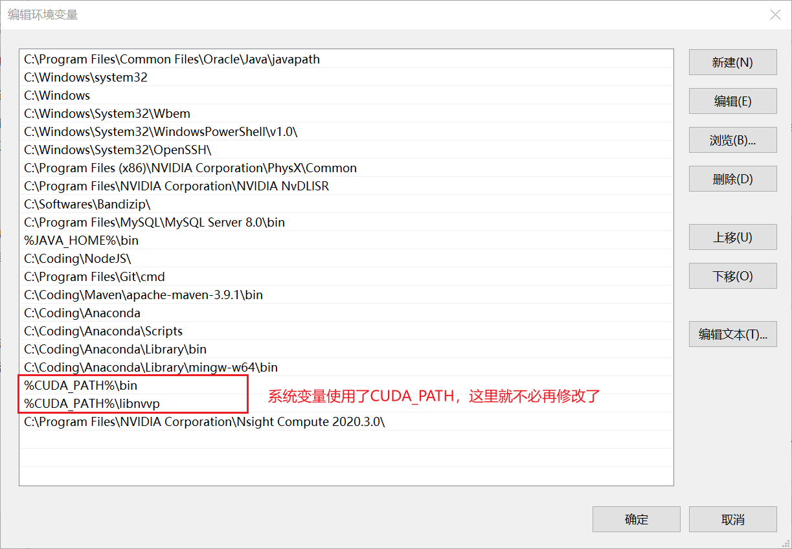
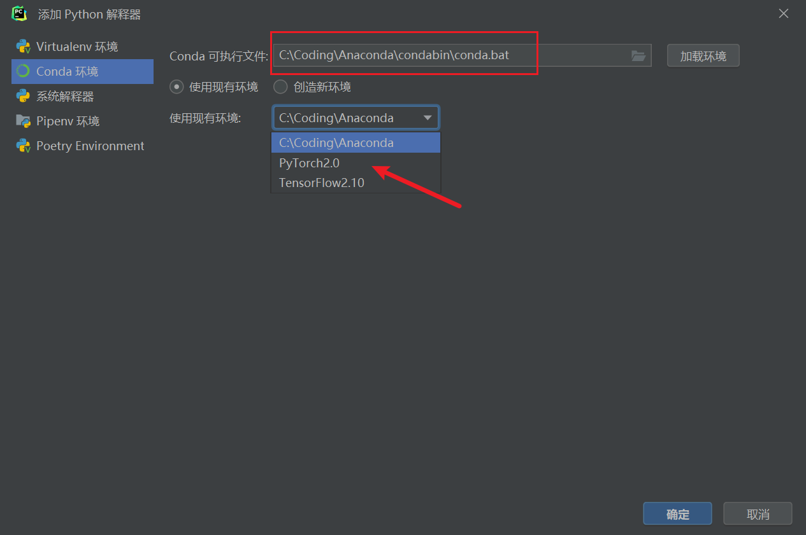

# 1、Conda

1. 查看当前所有环境：conda env list
2. 创建新的虚拟环境
    * conda create -n your_env_name python=x.x
    * conda create -n PyTorch2.0 python=3.11
    * conda create -n TensorFlow2.10 python=3.10
3. 激活虚拟环境：conda activate your_env_name
4. 删除虚拟环境：conda remove -n your_env_name --all

# 2、PyTorch2.0

1. 访问[https://pytorch.org/get-started/locally/](https://pytorch.org/get-started/locally/)，
   获得安装命令，在虚拟环境中执行，如：<br>
   conda install pytorch torchvision torchaudio pytorch-cuda=11.8 -c pytorch -c nvidia<br>
2. 检查是否安装成功<br>
   import torch<br>
   torch.cuda.is_available()

# 3、TensorFlow2.10

1. 我们需要安装2.10版本的TensorFlow，因为之后的版本在原生的Windows上不再支持GPU<br>
   [https://www.tensorflow.org/install/source_windows#gpu](https://www.tensorflow.org/install/source_windows#gpu)
   
2. 安装[CUDA](https://developer.nvidia.com/cuda-11.2.0-download-archive)
   和[cuDNN](https://developer.nvidia.com/rdp/cudnn-archive)
3. pip install tensorflow==2.10
4. 检查是否安装成功<br>
   import tensorflow as tf<br>
   print(tf.config.list_physical_devices('GPU'))
5. 如果遇到缺少各种dll的情况，去CUDA的bin路径下寻找，如：C:\Program Files\NVIDIA GPU Computing Toolkit\CUDA\v11.2\bin，<br>
   然后把它们复制到C:\Windows\System32目录下即可

# 4、CUDA

1. 安装多个版本的CUDA时，后安装的CUDA选择自定义安装时只需要安装第一个（即CUDA）即可
   
2. 多个版本的CUDA共存时，可以使用CUDA_PATH来控制环境变量，如下图所示
   

# 5、Pycharm

在新版（2023.1.1）的Pycharm中，添加Conda环境的方法是：选择Anaconda\condabin\conda.bat作为Conda可执行文件，再选择创建和配置好的虚拟环境


# 6、安装常用的包

## 分开来安装

1. conda install numpy
2. conda install pandas
3. conda install scipy
4. conda install statsmodels
5. conda install matplotlib
6. conda install scikit-learn

## 一次性安装多个包

这是一个操作的例子：

1. 定义一个txt文件，里面是要安装的包名，如：
   requirements_conda.txt
   ```
   numpy
   pandas
   scipy
   statsmodels
   matplotlib
   scikit-learn
   ```
   注意：
    * 一行一个
    * 可以这样指定具体的版本： numpy==1.19.4
2. 激活目标虚拟环境后，cd到txt文件所在目录，如：cd C:\Users\TRXCX\Downloads
3. 执行conda install --file=requirements_conda.txt即可