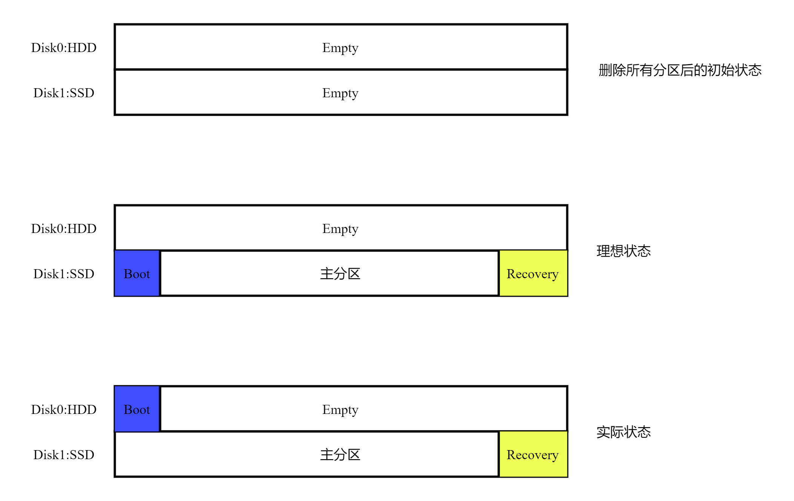

我的电脑上有两块硬盘：HDD+SSD，其中HDD是Disk0，SSD是Disk1。 
当我想要重装系统时，我当然是要把Windows安装到SSD上的。

由此产生的一个问题是： 
在我的理想状态下：所有文件都应该在SSD上 
然而实际上：主分区和恢复分区在SSD上，但是启动分区在HDD上 
如下图所示：

我大概尝试了以下3种方法:

1. 先给SSD分区，以为这样安装系统时就不会产生分区到HDD
2. 直接删除HDD上的Boot分区，再在SSD修复引导
3. 先把系统安装在HDD，再整体迁移到SSD
    
   以上的尝试无一例外都失败了 
   事实上，一个正确的解决方法是：先从主板上取下HDD，把系统安装到SSD上，这时所有分区都在SSD上符合我的要求，之后再将HDD连接到主板上

这时我突然意识到一件事情，那就是： 
按照我的要求，我最后会得到作为C盘的SSD+作为D盘的HDD 
按照目前这种情况，安装完系统之后，再将HDD的Empty部分建立分区，我得到的依然是作为C盘的SSD+作为D盘的HDD 
二者唯一的微小区别是：在现在这种情况下，SSD相比我要求的情况多了Boot分区大小的空间，这甚至是一件好事（但是只能好一点点，因为引导分区在HDD似乎会影响启动速度）

于是我按照图中所表示的实际情况，安装完系统后为HDD的Empty部分建立了新的分区，作为D盘。 
这件事情浪费了我3个多小时，实在是不值得，写下这篇blog提醒自己：强迫症可以有，但是如果结果都是一样的话，形式的差别就不要太勉强了，毕竟我确实没有办法去从主板上取下硬盘。